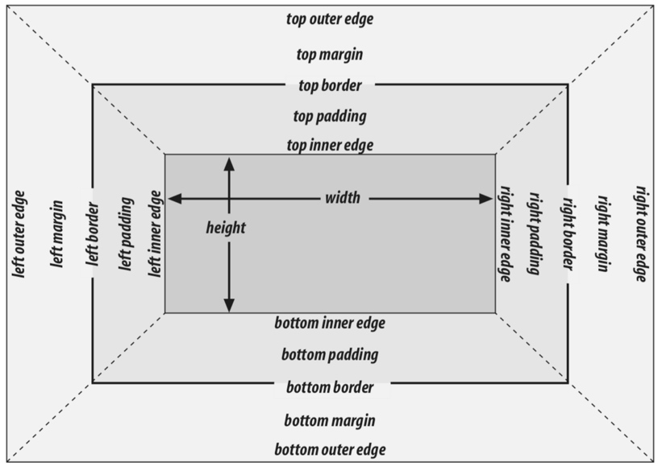

# CSS

## 常规流

常规流是从左到右、从上到下渲染文本，要让元素脱离常规流，唯一的方式是让元素成为浮动、定位元素，或者让它进入弹性盒或者网格布局元素relative是不会使元素脱离文档流的，absolute和fixed则会

## 非可替换元素

内容是在元素本身内可以找到

## 可替换元素

img input等

## 根元素

html

## 块盒（Block box）

* 前后换行，display: block
* 行内盒（Inline box）
* 前后不换行，display: inline
* 行内块盒（Inline-block box）

把一个 div 像一个行内图像一样插入一行文本中

## 包含块

每个元素的盒子都是相对于它的包含块来布局

根据定位元素的不同：position

static（默认）与relative：由最近的块级、单元格（td,th）、行内块创建（tr，em不属于）

fixed：包含块是当前可视窗口（viewport）

absolute：

* 绝对定位元素的包含块由离它最近的 'position' 属性为 'absolute'、'relative' 或者 'fixed' 的祖先元素创建，也就是非static祖先元素
* 但是如果当这个祖先元素为行内元素的时候，包含块就要取决于祖先元素的direction元素了


完整的盒模型


## 水平格式化

margin-left、border-left、 padding-left、width、padding-right、border-right 和 margin-right

* 其中可以设置为auto的有 width、margin-left、margin-right
* 两个外边距设置为相等长度是将块盒内元素居中的正确方法
* 如果这三个属性都被设置为 auto 会出现什么情况？两个外边距都被设置为零，margin 默认为零，width 默认为 auto
* 可替换元素的width设置为auto时，width的值和元素本身的值相同

## 垂直格式化

margin-top、border-top、padding-top、height、padding-bottom、border-bottom 和 margin-bottom

* height、margin-top 和 margin-bottom可以被设置为auto
* 百分比高度
* auto高度
  * 块级元素的height设置为auto时，默认高度将是最上面的块级子元素的边框的外边缘顶部，到最下面的块级子元素的边框的外边缘底部之间的距离
  * 块级元素的height设置为auto时，如果块级元素有上或者下内边距，或者上或者下边框，那么它的高度就是从它最上面的子元素的上外边距边缘顶部，到它最下面的子元素的下外边距边缘底部之间的距离
* 正负边距的折叠
* 列表条目
