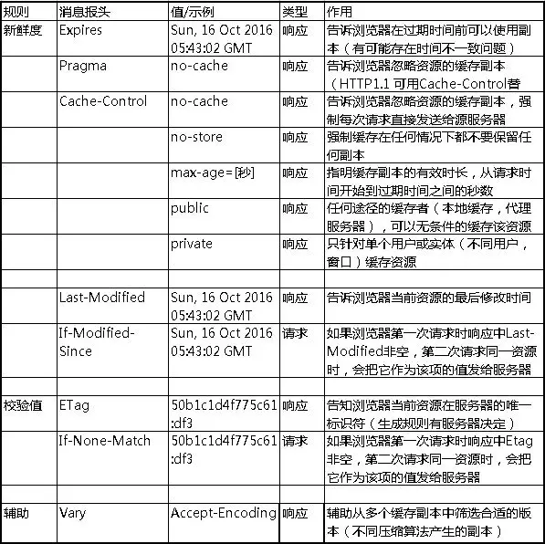

# HTML缓存

## http协议缓存

[知乎详细讲解](https://zhuanlan.zhihu.com/p/53507705)

[微信公众号详细讲解](https://mp.weixin.qq.com/s?__biz=MzAxODE2MjM1MA==&mid=2651556794&idx=1&sn=0186d0c4b36b6e7e0adf7ffaf7b3f9b8)（这个比较好懂一点）

http协议缓存机制 web 性能优化的重要手段，分为强制缓存和对比缓存

* 对于强制缓存，服务器通知浏览器一个缓存时间，在缓存时间内cache-control，下次请求，直接用缓存，不在时间内，执行比较缓存策略。`state code` 为 200
* 对于比较缓存，将缓存信息中的Etag和Last-Modified通过请求发送给服务器，由服务器校验，返回304状态码时，浏览器直接使用缓存。

### 优先级的问题

* Cache-Control/Expires 优先于 Last-Modified/ETag
  * 强制缓存优先于对比缓存
* Cache-Control 优先于 Expires
* ETag 优先于 Last-Modified
  * Last-Modified 精确到秒，如果在1秒内有好几个操作，则不能区分
  * 如果某些文件会被定期生成，当有时内容并没有任何变化，但 Last-Modified 却改变了，导致文件没法使用缓存
  * Last-Modified 服务器时间与客户端时间可能不一致

### 哪些请求不能被缓存

无法被浏览器缓存的请求：

* HTTP信息头中包含Cache-Control:no-cache，pragma:no-cache，或Cache-Control:max-age=0等告诉浏览器不用缓存的请求
* 需要根据Cookie，认证信息等决定输入内容的动态请求是不能被缓存的
* 经过HTTPS安全加密的请求（有人也经过测试发现，ie其实在头部加入Cache-Control：max-age信息，firefox在头部加入Cache-Control:Public之后，能够对HTTPS的资源进行缓存，参考《HTTPS的七个误解》)
* POST请求无法被缓存
* HTTP响应头中不包含Last-Modified/Etag，也不包含Cache-Control/Expires的请求无法被缓存

## HTML5的离线储存怎么使用，工作原理能不能解释一下

原理：HTML5的离线存储是基于一个新建的.appcache文件的缓存机制(不是存储技术)，通过这个文件上的解析清单离线存储资源，这些资源就会像cookie一样被存储了下来。之后当网络在处于离线状态下时，浏览器会通过被离线存储的数据进行页面展示。

* 页面头部像下面一样加入一个manifest的属性；
* 在cache.manifest文件的编写离线存储的资源；
* 在离线状态时，操作window.applicationCache进行需求实现。
  