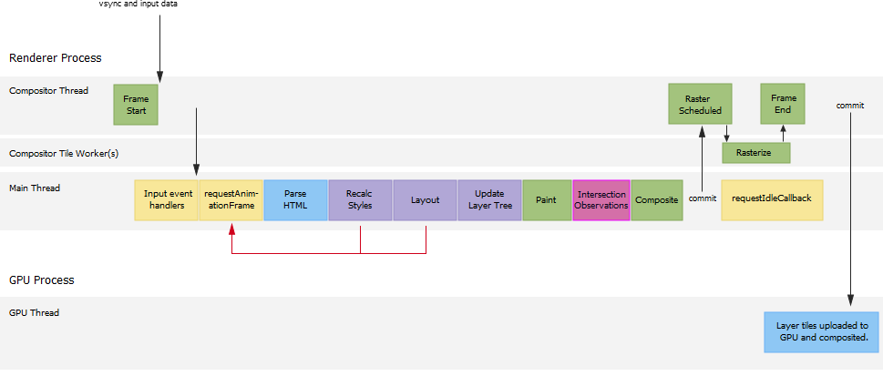

# IntersectionObserver

IntersectionObserver API 是用来监视某个元素是否滚动进了浏览器窗口的可视区域（视口）或者滚动进了它的某个祖先元素的可视区域内。它的主要功能是用来实现**懒加载**和**页面无限滚动**。

IntersectionObserver是浏览器原生提供的构造函数，接受两个参数：callback是可见性变化时的回调函数，option是配置对象（该参数可选）。

```JS
var io = new IntersectionObserver(callback, option);
io.observe(document.getElementById('example'));  // 开始观察
io.unobserve(element); // 停止观察
io.disconnect();  // 关闭观察器

//还有一个不常用的方法
io.takeRecords()
```

## callback 回调函数

```JS
var io = new IntersectionObserver(
  entries => {
    console.log(entries);
  }
);
```

callback函数的参数（entries）是一个数组，每个成员都是一个IntersectionObserverEntry对象。举例来说，如果同时有两个被观察的对象的可见性发生变化，entries数组就会有两个成员。

## IntersectionObserverEntry 对象

IntersectionObserverEntry对象提供目标元素的信息，一共有六个属性

```JS
{
  time: 3893.92,  //可见性发生变化的时间，是一个高精度时间戳，单位为毫秒
  rootBounds: ClientRect {  //根元素的矩形区域的信息，getBoundingClientRect()方法的返回值，如果没有根元素（即直接相对于视口滚动），则返回null
    bottom: 920,
    height: 1024,
    left: 0,
    right: 1024,
    top: 0,
    width: 920
  },
  boundingClientRect: ClientRect {
     // 目标元素的矩形区域的信息
  },
  intersectionRect: ClientRect {
    // 目标元素与视口（或根元素）的交叉区域的信息
  },
  intersectionRatio: 0.54, //目标元素的可见比例，即intersectionRect占boundingClientRect的比例，完全可见时为1，完全不可见时小于等于0
  target: element  //被观察的目标元素，是一个 DOM 节点对象
}
```

## Option 对象

IntersectionObserver构造函数的第二个参数是一个配置对象。它可以设置以下属性

* threshold 属性
  * threshold属性决定了什么时候触发回调函数
  * 它是一个数组，每个成员都是一个门槛值，默认为[0]，即交叉比例（intersectionRatio）达到0时触发回调函数
* root 属性
  * root属性指定目标元素所在的容器节点（即根元素）
  * 容器元素必须是目标元素的祖先节点。
* rootMargin 属性
  * 后者定义根元素的margin，用来扩展或缩小rootBounds这个矩形的大小，从而影响intersectionRect交叉区域的大小。
  * 它使用CSS的定义方法，比如10px 20px 30px 40px，表示 top、right、bottom 和 left 四个方向的值。

## 原理

IntersectionObserver API 是**异步**的，不随着目标元素的滚动同步触发。

在浏览器内部，当一个观察者实例在某一时刻观察到了若干个相交动作时，它不会立即执行回调，它会调用 window.requestIdleCallback() 来异步的执行我们指定的回调函数 (callback) ，而且还规定了最大的延迟时间是 100 毫秒，相当于浏览器会执行：

```JS
requestIdleCallback(() => {
  if (entries.length > 0) {
    callback(entries, observer)
  }
}, {
  timeout: 100
})
```

你的回调可能在随后 1 毫秒内就执行，也可能在第 100 毫秒才执行，这是不确定的。在这不确定的 100 毫秒之间的某一刻，假如你迫切需要知道这个观察者实例有没有观察到相交动作，你就得调用 takeRecords() 方法，它会同步返回包含若干个 IntersectionObserverEntry 对象的数组（IntersectionObserverEntry 对象包含每次相交的信息，在下节讲），如果该观察者实例此刻并没有观察到相交动作，那它就返回个空数组。

注意，对于同一个相交信息来说，同步的 takeRecords() 和异步的回调函数是互斥的，如果回调先执行了，那么你手动调用 takeRecords() 就必然会拿到空数组，如果你已经通过 takeRecords() 拿到那个相交信息了，那么你指定的回调就不会被执行了（entries.length > 0 是 false）


