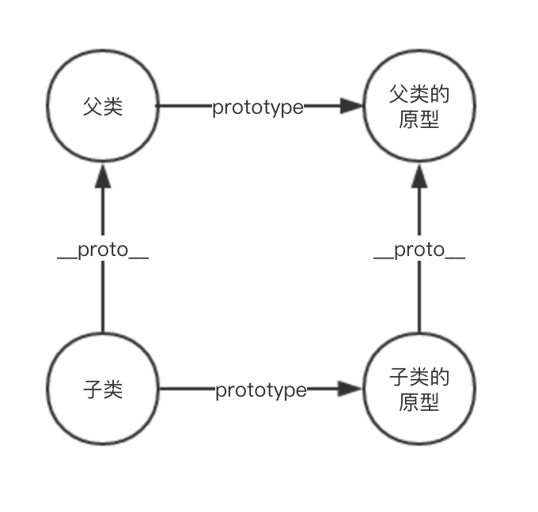

# ES6 类

> [参考来源](http://es6.ruanyifeng.com/#docs/class-extends)

ES6 中类就是构造函数，类中定义的所用方法，都是定义在类的prototype属性上面。

```JS
class Point {
  // ...
}
typeof Point // "function"
Point === Point.prototype.constructor // true
```

类的新方法可以添加在 `prototype` 对象上面。Object.assign方法可以很方便地一次向类添加多个方法。

```JS
class Person {
  speak () {
    console.log('I am Person!')
  }
}
//会被Babel转成：
function Person(){}
Object.defineProperty(Person.prototype,'speak',{
  value: function () { 'I am Person!' },
  enumerable: false,
  configurable: true,
  writable: true
})
```

类的内部所有定义的方法，都是**不可枚举的**（non-enumerable）。而 ES5 的写法，定义在原型上的方法就是可枚举的（为什么设计成为不可枚举？）

constructor方法默认返回实例对象（即this），完全可以指定返回另外一个对象

```JS
class Foo {
  constructor() {
    return Object.create(null);
  }
}

new Foo() instanceof Foo
// false
//constructor函数返回一个全新的对象，结果导致实例对象不是Foo类的实例
```

原型方法 与 实例属性

类的声明不存在变量提升（hoist），这一点与 ES5 完全不同。

## Class 里面为什么经常看到使用箭头函数

在 JavaScript 中，class 的方法默认不会绑定 this。

类的方法内部如果含有this，它默认指向类的实例。但是，必须非常小心，一旦单独使用该方法，很可能报错。

```JS
class Logger {
  printName(name = 'there') {
    this.print(`Hello ${name}`);
  }

  print(text) {
    console.log(text);
  }
}

const logger = new Logger();
const { printName } = logger;
printName(); // TypeError: Cannot read property 'print' of undefined
```

上面代码中，printName方法中的this，默认指向Logger类的实例。但是，如果将这个方法提取出来单独使用，this会指向该方法运行时所在的环境（由于 class 内部是严格模式，所以 this 实际指向的是undefined，从而导致找不到print方法而报错。

解决方法：

* 在构造方法中绑定this
  * this.printName = this.printName.bind(this);
* 使用箭头函数
  * 箭头函数内部的this总是指向定义时所在的对象
* 使用Proxy，获取方法的时候，自动绑定this

```JS
//方式一
class Foo extends React.Component{
  handleClick = () => {
    console.log(this);
  }

  render(){
    return (
      <button type="button" onClick={this.handleClick}>
        Click Me
      </button>
    )
  }
}
ReactDOM.render(
  <Foo />,
  document.getElementById("app")
)
```

```JS
//方式二
class Foo extends React.Component{
 handleClick(event){
    console.log(this);
  }
  render(){
    return (
      <button type="button" onClick={(e) => this.handleClick(e)}>
        Click Me
      </button>
    );
  }

ReactDOM.render(
  <Foo />,
  document.getElementById("app")
);
```

## 静态方法

类中定义的方法一般都会被实例继承，但是加上static关键字，就表示该方法不会被实例继承，而是直接通过类来调用。

```JS
class Foo {
  static classMethod() {
    return 'hello';
  }
}

Foo.classMethod() // 'hello'

var foo = new Foo();
foo.classMethod()
// TypeError: foo.classMethod is not a function
```

静态方法可以和非静态方法重名（为什么？）

如果静态方法包含this关键字，这个this指的是类，而不是实例。

```JS
class Foo {
  static bar() {
    this.baz();
  }
  static baz() {
    console.log('hello');
  }
  baz() {
    console.log('world');
  }
}

Foo.bar() // hello
```

父类的静态方法，可以被子类继承。

## 实例属性

实例属性除了在 `constructor` 方法中写，还可以定义在类的最顶层

## 静态属性

静态属性指的是 Class 本身的属性，即Class.propName，而不是定义在实例对象（this）上的属性

ES6 明确规定，Class 内部只有静态方法，没有静态属性。

## 私有属性和私有方法

在属性挥着方法前面加上 `#` 表示是类的私有属性和私有方法

## 类的继承

子类**必须在 constructor 方法中调用 super 方法**，否则新建实例时会报错。这是因为子类自己的this对象，必须先通过父类的构造函数完成塑造，得到与父类同样的实例属性和方法，然后再对其进行加工，加上子类自己的实例属性和方法。**如果不调用 super 方法，子类就得不到 this 对象。**

ES5 的继承，实质是先创造子类的实例对象this，然后再将父类的方法添加到this上面（Parent.apply(this)）。

ES6 的继承机制完全不同，实质是先将父类实例对象的属性和方法，加到this上面（所以必须先调用super方法），然后再用子类的构造函数修改this。

## Object.getPrototypeOf()

Object.getPrototypeOf方法可以用来从子类上获取父类。

```JS
Object.getPrototypeOf(ColorPoint) === Point
// true
```

## super 关键字

super 这个关键字，既可以当作函数使用，也可以当作对象使用。在这两种情况下，它的用法完全不同。

* super()
  * 相当于 Parent.prototype.constructor.call(this)，代表调用父类的构造函数
* super.something
  * super作为对象时，在普通方法中，指向父类的原型对象；在静态方法中，指向父类。

## 类的 prototype 属性和__proto__属性



## 原生构造函数的继承

ES5 无法继承原生的构造函数，因为其`是先创造子类的实例对象this，然后再将父类的方法添加到this上面（Parent.apply(this)）`，所以不能拿到一些方法，而ES6 因其`先将父类实例对象的属性和方法，加到this上面（所以必须先调用super方法），然后再用子类的构造函数修改this`可以继承原生的构造函数

## extends实现原理

```JS
//原型连接
Child.prototype = Object.create(Parent.prototype)
// Child继承Parent的静态属性
Object.setPrototypeOf(Child, Parent)
//绑定this
Parent.call(this)
```

## ES6类继承与构造器原型继承（ES5）区别

>[参考](https://github.com/Advanced-Frontend/Daily-Interview-Question/issues/20)

* class 声明会提升，但不会初始化赋值。Foo 进入暂时性死区，类似于 let、const 声明变量。
* class 声明内部会启用严格模式。
* class 的所有方法（包括静态方法和实例方法）都是不可枚举的。
* class 的所有方法（包括静态方法和实例方法）都没有原型对象 prototype，所以也没有[[construct]]，不能使用 new 来调用。

```JS
class Foo {
  constructor() {
    this.foo = 42;
  }
  print() {
    console.log(this.foo);
  }
}
const foo = new Foo();
const fooPrint = new foo.print(); //// TypeError: foo.print is not a constructor
foo.print.__proto__ === Function.prototype //true
```

* 必须使用 new 调用 class。
* class 内部无法重写类名。
