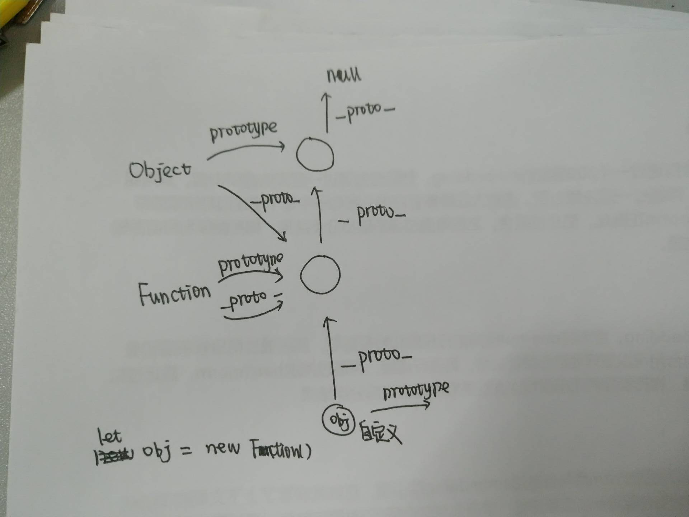
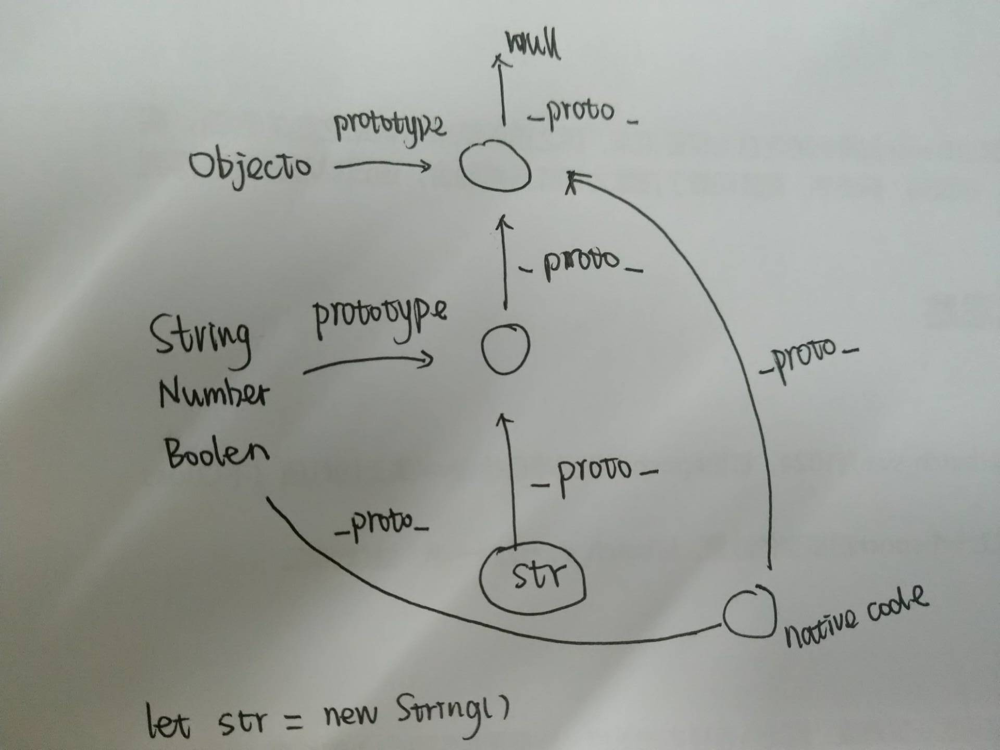
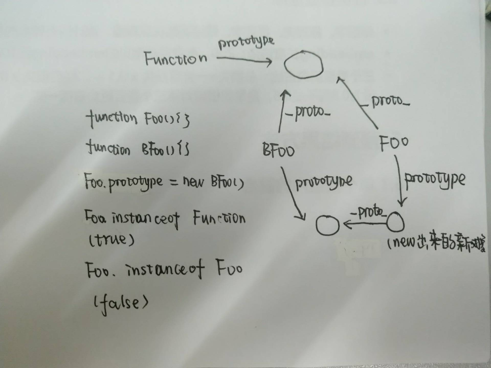

# 原型链与继承

## 原型链

当查找一个对象的属性或者方法时，JavaScript 会向上遍历原型链，直到找到给定名称的属性为止。

通过原型链实现继承

## 继承

> OO语言都支持两种继承方式：接口继承和实现继承。接口继承只继承方法签名，实现继承继承实际的方法。
>
> [详细讲解](https://juejin.im/post/58f94c9bb123db411953691b#heading-10)
>
> [JS原型链之 Object & Function](https://segmentfault.com/a/1190000012553959)

理解继承需要先理解三个概念：**构造函数**、**原型**以及**实例**。

构造函数、原型、实例的关系：每个构造函数都有一个原型对象，原型对象包括一个指向构造函数的指针、实例都包括一个指向原型内部的指针。

原型链有下面几个特点：

* 原型链的构成是一个类型的原型对象等于另一个类型的实例，从而构成原型链
* 原型链的根节点都是Object，其中包含很多默认方法
* 可以重写方法
* 不能通过字面量的方法定义新方法，这样会导致链的断裂

原型链的缺点：

* 共享
* 不能给超类型构造函数传递参数（借用构造函数可以传入参数，call/aplly）

所以一般不单独使用原型链

### 原型继承

继承方式是通过__proto__建立和子类之间的原型链，当子类的实例需要使用父类的属性和方法的时候，可以通过__proto__一级级向上找；

```JS
function Animal(name) {
  this.name = name;
}
Animal.prototype.eat= function () {
  console.log(this.name + '正在吃东西')
};
function Cat(furColor){
   this.furColor = furColor ;
};
Cat.prototype = new Animal();  //继承的实现
let tom = new Cat('black');
console.log(tom)
```

缺点：

1. 创建子类实例时，无法向父类构造函数传参。Animal 类中的 name 属性为undefined，说明没有被赋值。因为**无法调用父类的构造函数并传参**。
2. Animal类的私有属性被所有实例共享。来自父类 Animal 中的私有属性 name 被放到了 Cat 类的原型，导致 name **属性被所有实例所共享**。

### 构造函数继承

```JS
function Animal(name) {
  this.name = name;
}
Animal.prototype.eat= function () {
  console.log(this.name + '正在吃东西')
};
function Cat(furColor){
   Animal.call(this,'小花猫');  //这里这里！！
   this.furColor = furColor ;
};
let tom = new Cat('black');   //实例，但是没有继承！
console.log(tom);
```

这里解决了原型继承的两个问题，第一无法向构造函数传参的问题，第二Animal的私有属性被共享的问题。但是又产生了新的问题：

1. 没有继承父类的原型，有些方法比如eat方法无法使用
2. 实例并不是父类的实例，只是子类的实例，原因也是因为没有继承Animal的原型

```JS
console.log(tom instanceof Animal); // false
console.log(tom instanceof Cat); // true
```

### 组合继承

借用原型链和构造函数的优点，让不同的实例既可以拥有自己的属性，又可以共用方法。

```JS
function Parent(name) {
    this.name = name;
}
Parent.prototype.sayName = function() {
    console.log('parent name:', this.name);
}
Parent.prototype.doSomething = function() {
    console.log('parent do something!');
}
function Child(name, parentName) {
    Parent.call(this, parentName);  //here {1}
    this.name = name;
}
Child.prototype = new Parent();  //here {2}
Child.prototype.constructor = Child;  //here {3}

Child.prototype.sayName = function() {
    console.log('child name:', this.name);
}
var child = new Child('son');
child.sayName();       // child name: son
child.doSomething();   // parent do something!
```

组合继承还有一个要注意的地方：
在代码 {3} 处，将子类原型的 constructor 属性指向子类的构造函数。因为如果不这么做，子类的原型是父类的一个实例，所以子类原型的 constructor 属性就丢失了，他会顺着原型链继续往上找，于是就找到了父类的 constructor 所以它指向的其实是父类。

这种继承方式解决了上两种方式的缺点，不会出现**共享引用类型**的问题，同时父类原型中的方法也被继承了下来。

缺点：重复创建属性，在创建 Child 实例的时候，调用 Parent 的构造函数，又会在新的对象上创建属性 name，于是，这个属性就屏蔽了原型中的同名属性。

### 寄生组合式继承

基本思路就是：不必为了指定子类型的原型而调用父类的够着函数，我们需要的无非就是父类原型的一个副本而已。本质上就是**复制出父类的一个副本**，然后再将结果指定给子类型的原型。

```JS
function Parent(name) {
    this.name = name;
}
Parent.prototype.sayName = function() {
    console.log('parent name:', this.name);
}

function Child(name, parentName) {
    Parent.call(this, parentName);  
    this.name = name;
}
//////////////////////////////////////////////////
//方式一
function create(proto) {  //等同于 Object.creat 的方法
    function F(){}
    F.prototype = proto;
    return new F();
}
Child.prototype = create(Parent.prototype);
Child.prototype.constructor = Child;

//方式二
function inheritPrototype(Parent, Child) {
    Child.prototype = Object.create(Parent.prototype);//修改
    Child.prototype.constructor = Child;
}
inheritPrototype(Parent, Child);
//////////////////////////////////////////////

Child.prototype.sayName = function() {
    console.log('child name:', this.name);

var parent = new Parent('father');
parent.sayName();    // parent name: father
var child = new Child('son', 'father');
child.sayName();     // child name: son
```

### ES6继承

ES5 的继承，实质是先创造子类的实例对象this，然后再将父类的方法添加到this上面（Parent.apply(this))。

ES6 的继承机制完全不同，实质是先将父类实例对象的属性和方法，加到this上面（所以必须先调用super方法），然后再用子类的构造函数修改this。

```JS
class Parent {
    constructor(name) {
        this.name = name;
    }
    doSomething() {
    console.log('parent do something!');
    }
    sayName() {
    console.log('parent name:', this.name);
    }
}

class Child extends Parent {
    constructor(name, parentName) {
        super(parentName);
        this.name = name;
    }
    sayName() {
    console.log('child name:', this.name);
    }
}
const child = new Child('son', 'father');
child.sayName();            // child name: son
child.doSomething();        // parent do something!

const parent = new Parent('father');
parent.sayName();           // parent name: father
```

原型链分析

```JS
//案例1
console.log(String instanceof String);//false
//案例2
console.log(Object instanceof Object);//true
console.log(Function instanceof Function);//true
console.log(Function instanceof Object);//true
//案例3
function Foo(){}
function BFoo(){}
Foo.prototype = new BFoo();
console.log(Foo instanceof Function); //true
console.log(Foo instanceof Foo);//false
console.log(Foo instanceof BFoo);//false
console.log(Foo.prototype instanceof BFoo);//true
```





## 理解构造函数和原型对象

> [来源](https://juejin.im/post/59ab6c16f265da2476425745)
