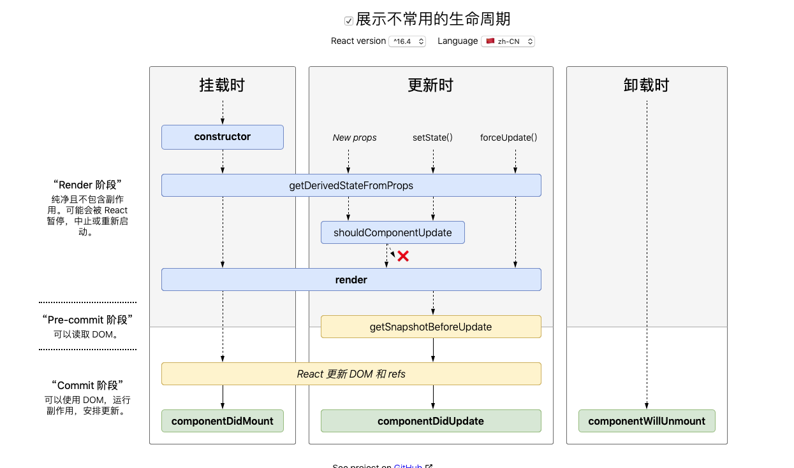

# React的生命周期

## 刚学习React的时候的生命周期（V16.3）

> 刚推行 getDerivedStateFromProps()，没有立即使用

共7个生命周期

* componentWillMount
* componentDidMount
* componentWillUnmount——在卸载组件之前，你不能再设置 state
* componentWillUpdate——不能调用 setState
* componentDidUpdate
* shouldComponentUpdate——不能调用setstate
* componentWillReceiveProps

```JS
// 初始化
constructor() {}
componentWillMount(){}
render()
componentDidMount(){}

//state change
shouldComponentUpdate(){} //返回true or false 是否执行更新
componentWillUpdate(){}
render()
componentWillUpdate(){}

//props change
componentWillReceiveProps(){}
shouldComponentUpdate(){}
componentWillUpdate(){}
render()
componentWillUpdate(){}

//unmount
componentWillUnmount(){}
```

## V16.4之后的生命周期

共有6个生命周期

* getDerivedStateFromProps
* shouldComponentUpdate
* getSnapshotBeforeUpdate
* componentDidMount
* componentDidUpdate
* componentWillUnmount

计划删除  componentWillMount，componentWillReceiveProps，componentWillUpdate 三个生命周期

不建议在 shouldComponentUpdate() 中进行深层比较或使用 JSON.stringify()。这样非常影响效率，且会损害性能。（这个性能会比更新一个render的损耗要大吗？

```JS
// 挂载时
constructor() {}
getDerivedStateFromProps(){}
render()
componentDidMount(){}

//state change or props change
getDerivedStateFromProps(){}
shouldComponentUpdate(){} //返回true or false 是否执行更新
render()
getSnapshotBeforeUpdate(){}
componentWillUpdate(){}

//unmount
componentWillUnmount(){}
```

```JS
class ExampleComponent extends React.Component {
  // 用于初始化 state
  constructor() {}
  // 用于替换 `componentWillReceiveProps` ，该函数会在初始化和 `update` 时被调用
  // 因为该函数是静态函数，所以取不到 `this`
  // 如果需要对比 `prevProps` 需要单独在 `state` 中维护
  static getDerivedStateFromProps(nextProps, prevState) {}
  // 判断是否需要更新组件，多用于组件性能优化
  shouldComponentUpdate(nextProps, nextState) {}
  // 组件挂载后调用
  // 可以在该函数中进行请求或者订阅
  componentDidMount() {}
  // 用于获得最新的 DOM 数据（例如，滚动位置）。此生命周期的任何返回值将作为参数传递给 componentDidUpdate()。
  getSnapshotBeforeUpdate() {}
  // 组件即将销毁
  // 可以在此处移除订阅，定时器等等
  componentWillUnmount() {}
  // 组件销毁后调用
  componentDidUnMount() {}
  // 组件更新后调用
  componentDidUpdate() {}
  // 渲染组件函数
  render() {}
  // 以下函数不建议使用
  UNSAFE_componentWillMount() {}
  UNSAFE_componentWillUpdate(nextProps, nextState) {}
  UNSAFE_componentWillReceiveProps(nextProps) {}
}
```


