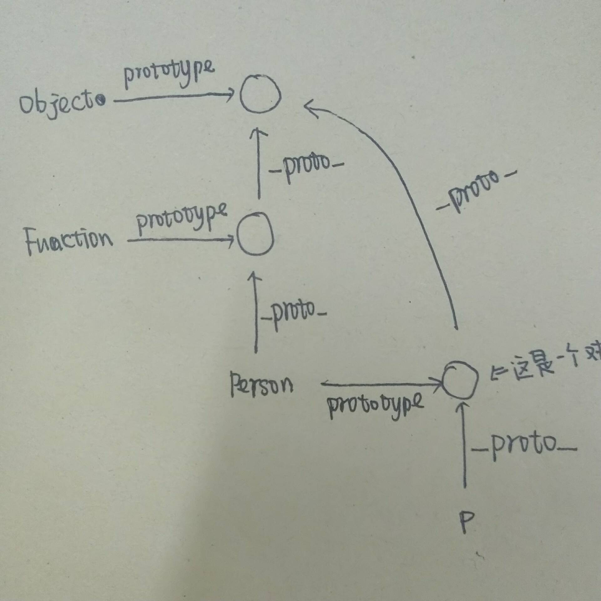

# 虾皮一面

```JS
A instanceof B

function Person(name) {
    this.name = name
 }

var p = new Person('ass')

p.__proto__ === Person.prototype //true
Person.prototype.__proto__ === Function.prototype //false
Function.prototype.__proto__ === null  //false 你脑子怕不是进水了？？？

Person.__proto__ === Function.prototype  //true
Person.prototype.__proto__ === Object.prototype  //true!!! 罚抄30遍！！！
Person.prototype.__proto__.__proto__ === null
//new 操作符做了什么！
```



```JS
function Person() {};

Person.prototype.name = 'human';
Person.prototype.like = {
  meat: true,
  vegetable: false
};

const p1 = new Person();
const p2 = new Person();

p1.name = 'Lily';
p1.like.vegetable = true;

console.log(p1.name);
//
console.log(p2.name);
//
console.log(p1.like.meat);
//
console.log(p2.like.meat);
//
console.log(p1.like.vegetable);
//
console.log(p2.like.vegetable);
//


var obj = {
    a: () => { console.log(this) },
    b: function (){ console.log(this) }
}

obj.a()
obj.b()


...global
function A {
    ...
    return function(){
        ....
    }
}
```
