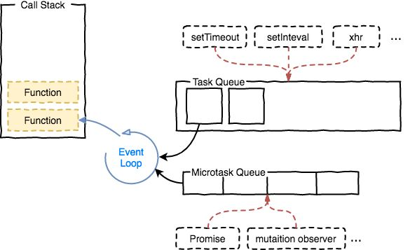

# 从进程线程角度谈事件循环与异步操作

> 参考：
>
> [从浏览器多进程到JS单线程，JS运行机制最全面的一次梳理](http://www.dailichun.com/2018/01/21/js_singlethread_eventloop.html)
>
> [JS 异步解决方案的发展历程以及优缺点](https://github.com/Advanced-Frontend/Daily-Interview-Question/issues/11)
>
> [Promise 对象](http://es6.ruanyifeng.com/#docs/promise)
>
> [async 函数](http://es6.ruanyifeng.com/#docs/async)
>
> [如何在 JS 循环中正确使用 async 与 await](https://github.com/qq449245884/xiaozhi/issues/54)
>
> [宏任务与微任务，常见异步笔试题](https://github.com/Advanced-Frontend/Daily-Interview-Question/issues/7)

首先，必须清楚的是浏览器的运行是一个多进程的，每个进程又有很多相应的线程。

进程与线程的区别：

* 进程是cpu资源分配的最小单位（是能拥有资源和独立运行的最小单位）
* 线程是cpu调度的最小单位（线程是建立在进程的基础上的一次程序运行单位，一个进程中可以有多个线程）

## 浏览器有哪些进程

* Browser进程：浏览器的主进程（负责协调、主控），只有一个。作用有
  * 负责浏览器界面显示，与用户交互。如前进，后退等
  * 负责各个页面的管理，创建和销毁其他进程
  * 将Renderer进程得到的内存中的Bitmap，绘制到用户界面上
  * 网络资源的管理，下载等
* 第三方插件进程：每种类型的插件对应一个进程，仅当使用该插件时才创建
* GPU进程：最多一个，用于3D绘制等
* 浏览器渲染进程（浏览器内核）（Renderer进程，内部是多线程的）：**默认每个Tab页面一个进程，互不影响**。主要作用为
  * 页面渲染，脚本执行，事件处理等
  
> 在浏览器中打开一个tab相当于新起了一个进程（进程内有自己的多线程）

## 一个渲染进程(tab进程)又有哪些线程


* GUI渲染线程
  * 负责渲染浏览器界面，解析HTML，CSS，构建DOM树和RenderObject树，布局和绘制等。
  * 当界面需要重绘（Repaint）或由于某种操作引发回流(reflow)时，该线程就会执行

> 注意，GUI渲染线程与JS引擎线程是互斥的，当JS引擎执行时GUI线程会被挂起（相当于被冻结了），GUI更新会被保存在一个队列中等到JS引擎空闲时立即被执行。

* JS引擎线程
  * 也称为JS内核，负责处理Javascript脚本程序。（例如V8引擎）
  * JS引擎线程负责解析Javascript脚本，运行代码。
  * JS引擎一直等待着任务队列中任务的到来，然后加以处理，一个Tab页（renderer进程）中无论什么时候都只有一个JS线程在运行JS程序

> 同样注意，GUI渲染线程与JS引擎线程是互斥的，所以如果JS执行的时间过长，这样就会造成页面的渲染不连贯，导致页面渲染加载阻塞。

* 事件触发线程
  * 归属于浏览器而不是JS引擎，用来控制事件循环（可以理解，JS引擎自己都忙不过来，需要浏览器另开线程协助）
  * 当JS引擎执行代码块如setTimeOut时（也可来自浏览器内核的其他线程,如鼠标点击、AJAX异步请求等），会将对应任务添加到事件线程中
  * 当对应的事件符合触发条件被触发时，该线程会把事件添加到待处理队列的队尾，等待JS引擎的处理

> 注意，由于JS的单线程关系，所以这些待处理队列中的事件都得排队等待JS引擎处理（当JS引擎空闲时才会去执行）

* 定时触发器线程
  * 传说中的setInterval与setTimeout所在线程
  * 浏览器定时计数器并不是由JavaScript引擎计数的,（因为JavaScript引擎是单线程的, 如果处于阻塞线程状态就会影响记计时的准确）
  * 因此通过单独线程来计时并触发定时（计时完毕后，添加到事件队列中，等待JS引擎空闲后执行）
  * 注意，W3C在HTML标准中规定，规定要求setTimeout中低于4ms的时间间隔算为4ms。

* 异步http请求线程
  * 在XMLHttpRequest在连接后是通过浏览器新开一个线程请求
  * 将检测到状态变更时，如果设置有回调函数，异步线程就产生状态变更事件，将这个回调再放入事件队列中。再由JavaScript引擎执行。

## 渲染进程中线程之间的关系

### GUI线程与JS线程之间是互斥的关系

浏览器设置GUI渲染线程与JS引擎为互斥的关系，当JS引擎执行时GUI线程会被挂起， GUI更新则会被保存在一个队列中等到JS引擎线程空闲时立即被执行。

```JS
//如果在控制台中运行以下函数，页面(选项卡)的 UI 是否仍然响应
function foo() {
  return Promise.resolve().then(foo);
};
//没有响应，一直在处理JS线程中的微任务，而JS线程又和GUI线程是互斥的关系，所以不会处理UI
```

每个宏任务之间都会进行一次 UI 渲染，而微任务需要等到微任务队列清空之后才会进行 UI 渲染

### WebWorker 与 SharedWorker

WebWorker 是 JS 针对密集型运算所开辟的线程。

JS 进程会堵塞 GUI 的渲染，如果是一个密集型的JS运算就会对用户交互非常不友好，所以HTML5中支持了 `Web Worker`，开辟一个JS主线程的子线程用来进行密集型运算，那这样是不是违背了`JS单线程`的原则呢？

Web Worker 不能操作DOM，这和当断把JS设计成为单线程的原因是一样的。

JS引擎线程与worker线程间通过特定的方式通信（postMessage API，需要通过序列化对象来与线程交互特定的数据）

* WebWorker只属于某个页面，不会和其他页面的Render进程（浏览器内核进程）共享
* SharedWorker是浏览器所有页面共享的，不能采用与Worker同样的方式实现，因为它不隶属于某个Render进程，可以为多个Render进程共享使用

WebWorker是一个线程，SharedWorker是一个进程

## 从 Event Loop 谈 JS 的运行机制

首先，我们需要理清楚几个概念：

* `全局内存(堆）`
* `调用堆栈`
* `任务队列`
* `Web API`
* `Event Loop`
* `微任务`
* `宏任务`

执行顺序是

同步任务--> 微任务 --> 宏任务

先处理全部的同步任务，直到调用堆栈为空，再处理全部的微任务，知道微任务队列为空，最后处理宏任务队列中的任务。（同步任务中的任务也是宏任务的一种）

* macrotasks：
  * setTimeout ，setInterval， setImmediate，requestAnimationFrame, I/O ，UI渲染
* microtasks:
  * Promise， process.nextTick， Object.observe， MutationObserver



> 异步任务包括：setTimeout，setInterval，promise，async/await, ajax等
>
> promise创建之后，写在函数体内的是同步任务，.then() .catch()中的是异步微任务
>
> async/await 是 promise+generator 的语法糖，await是创建一个 promise

```JS
async function async1() {
    console.log('async1 start');
    await async2();
    console.log('async1 end');
}
function async2() {
    console.log('async2');
}
//等价于
async function async1() {
    console.log('async1 start');
    Promise.resolve(async2()).then(() => {
      console.log('async1 end');
    })
}
//输出顺序：
//async1 start
//async2   ---> async2()是一个同步任务
//async1 end  微任务
```

## setTimeout和setInterval

也就是说 setTimeout 只能保证在指定的时间过后将任务(需要执行的函数)插入队列等候，并不保证这个任务在什么时候执行。执行javascript的线程会在空闲的时候，自行从队列中取出任务然后执行它。javascript通过这种队列机制，给我们制造一个异步执行的假象。

## 模拟实现promise

> [模拟实现promise](http://caibaojian.com/interview-map/frontend/#promise-%E5%AE%9E%E7%8E%B0)
> 感jio比较难，还没有详细看
