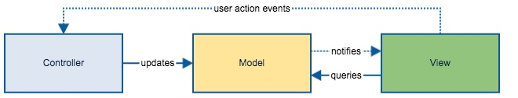
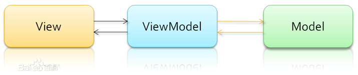

# 设计模式

## MVC模式

## React+Redux中的MVC

react作为视图展示
使用redux注册一个model（放数据的容器）
react只做View层展示，Component通过 redux 的connect链接代码仓库取数数据，在Component内部从props取数展示。
用来redux之后，Component 中的state，一般只做View控制状态的状态码的储存。
Redux API作为Model、Control层
Redux里的store里的state表示Model
Redux里的action和reducer表示Controller

## MVVM模式

双向绑定mvvm

View 代表UI 组件，它负责将数据模型转化成UI 展现出来。
ViewModel 监听模型数据的改变和控制视图行为、处理用户交互，简单理解就是一个同步View 和 Model的对象，连接Model和View。
在MVVM架构下，View 和 Model 之间并没有直接的联系，而是通过ViewModel进行交互，Model 和 ViewModel 之间的交互是双向的， 因此View 数据的变化会同步到Model中，而Model 数据的变化也会立即反应到View 上。

