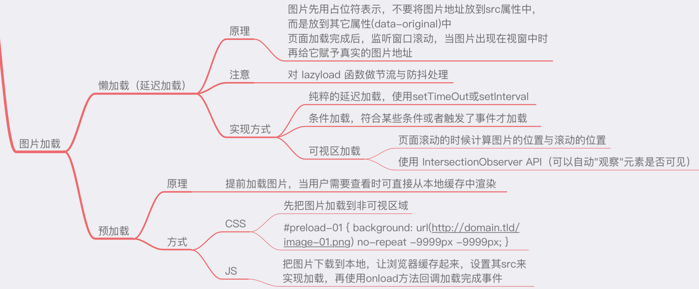

# 图片懒加载



图片懒加载的原理

* 图片先用占位符表示，src属性用一张默认图片
* 把真正的图片地址放在`data-src` 属性里面
* 页面加载完成之后，监听窗口滚动
* 当图片出现在视图中时，赋值真正的地址src

## img标签自定义属性相关

```HTML

```

## 判断元素进入视口viewport方法

* 图片距离顶部距离 < 视窗高度 + 页面滚动高度

```JS
function isInViewport(ele){
    ele.offsetTop < window.innerHeight + document.body.scrollTop
}
```

* getBoundingClientRect

Element.getBoundingClientRect()方法返回元素的大小及其相对于视口的位置

```JS
function isInViewport(ele) {
  // 元素顶部 距离 视口左上角 的距离top <= 窗口高度 （反例：元素在屏幕下方的情况）
  // 元素底部 距离 视口左上角 的距离bottom > 0 (反例：元素在屏幕上方的情况)
  // 元素display样式不为none
  const notBelow = ele.getBoundingClientRect().top <= window.innerHeight ? true : false;
  const notAbove = ele.getBoundingClientRect().bottom >= 0 ? true : false;
  const visable = getComputedStyle(ele).display !== "none" ? true : false;
  return notBelow && notAbove && visable ? true : false;
}
```

## 具体逻辑

```JS
function LazyLoad() {
  // 这个active是节流throttle所用的标志位，这里用到了闭包知识
  let active = false;

  const lazyLoad = () => {
    // throttle相关：200ms内只会执行一次lazyLoad方法
    if (active) return;
    active = true;

    setTimeout(() => {
      // 获取所有class为lazy的img标签，这里由于之前已经把处理过的img标签的class删掉了  所以不会重复查找
      let lazyImages = [].slice.call(document.querySelectorAll("img.lazy"));

      lazyImages.forEach(lazyImage => {
        // 判断元素是否进入viewport
        if (isInViewport(lazyImage)) {
          // 
          // ele.dataset.* 可以读取自定义属性集合，比如data-*
          // img.srcset 属性用于设置不同屏幕密度下，image自动加载不同的图片  比如
          lazyImage.src = lazyImage.dataset.src;
          lazyImage.srcset = lazyImage.dataset.srcset;
          // 删除class  防止下次重复查找到改img标签
          lazyImage.classList.remove("lazy");
        }

        // 当全部处理完了，移除监听
        if (lazyImages.length === 0) {
          document.removeEventListener("scroll", lazyLoad);
          window.removeEventListener("resize", lazyLoad);
          window.removeEventListener("orientationchange", lazyLoad);
        }
      })

      active = false;
    }, 200);
  }

  document.addEventListener("scroll", lazyLoad);
  document.addEventListener("resize", lazyLoad);
  document.addEventListener("orientationchange", lazyLoad);
}
```
